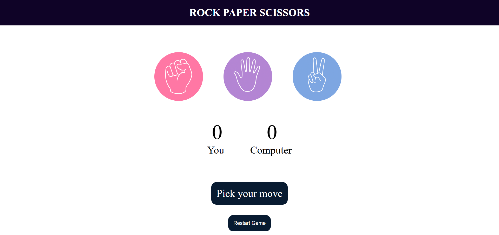

# 🎮 Rock Paper Scissors Game

A responsive and interactive Rock-Paper-Scissors game built using **HTML**, **CSS**, and **JavaScript**. The user can play against the computer, with real-time score tracking and smooth visual feedback.

---

## 🌐 Live Demo

👉 [Play the Game](https://gitwithankit.github.io/rock-paper-scissors/)

---

## 📷 Preview

> 

---

## 🚀 Features

- ✊ Choose between Rock, Paper, or Scissors
- 🧠 Computer makes a random choice
- 📊 Real-time scoreboard updates
- ✅ Win/Lose/Draw message after each round
- ♻️ Restart button to reset the scores
- 📱 Fully responsive layout for mobile and desktop
- ⚡ Clean animations and hover effects

---

## 🛠 Tech Stack

- **HTML5** – Structure of the page  
- **CSS3** – Styling and responsiveness  
- **JavaScript (ES6)** – Game logic and DOM interaction
